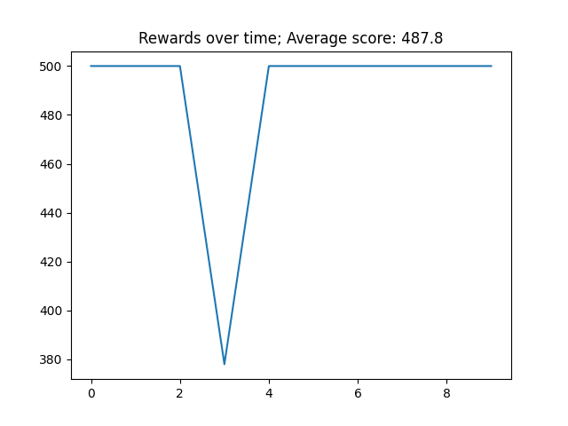

# Cart Pole - A Neural Network Solution
In this project I solve the CartPole-v1 problem from the "Gym" package (version 0.26.2) using a simple Neural Network implemented with Keras.

This program implement a Q-Learning strategies for predicting the best left/right move for the cart, and the goal is to achieve 500 frames before the pole fall down or exit the frame.

The model was able to achieve the goal pretty well as can be seen in the graph below (10 trials of test):

https://www.gymlibrary.dev/environments/classic_control/cart_pole/